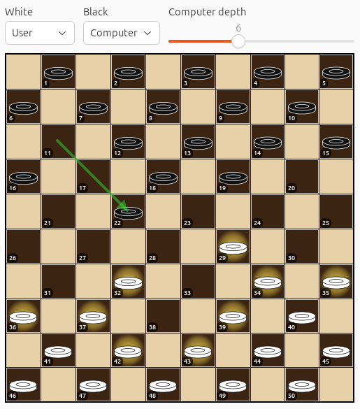
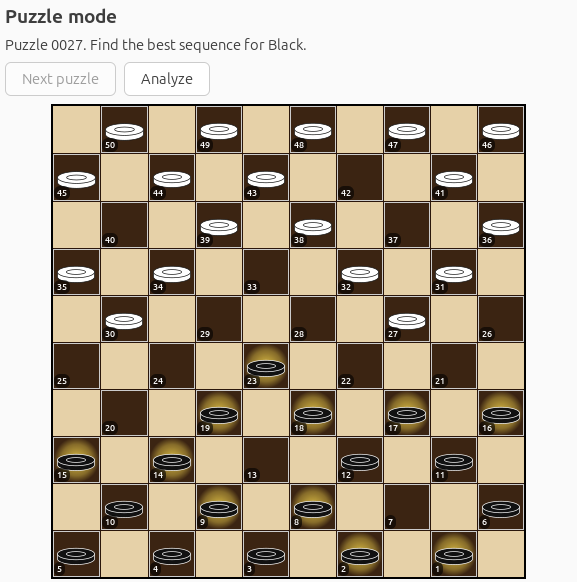
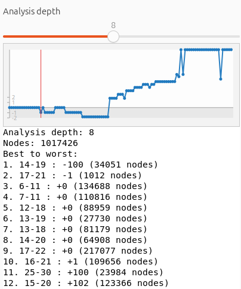
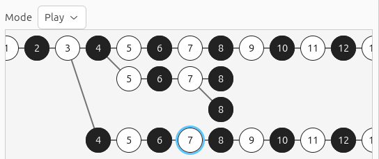

A desktop checkers program.

Main features:

### Play against the computer

Play a normal game either in hot-seat mode for two human players or against the computer.

### Puzzle mode

Solve tactical puzzles and verify the winning continuation.

### Full-game analysis

Analyze the current position or a full recorded game with move-by-move scores.

### Variation review

Browse SGF variations and navigate branching game records.

Build dependencies:

  - pkg-config
  - glib-2.0 development headers
  - gobject-2.0 development headers
  - GTK 4 development headers
  - libcurl development headers
  - glib-compile-schemas

Build the project:

  make

Install the desktop app metadata under a prefix:

  make install PREFIX=/tmp/gcheckers-appdir

Build the upstream Flatpak manifest locally:

  flatpak-builder --force-clean flatpak-build io.github.jeromea.gcheckers.yaml

Run the GTK application:

  build/bin/gcheckers
